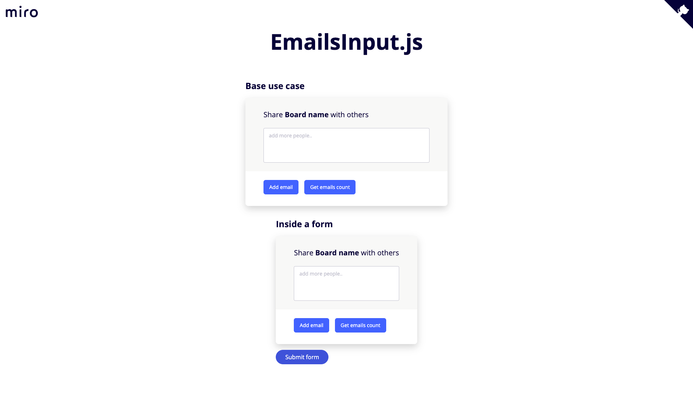

# EmailsInput.js

> Miro Front-end Engineer test

A vanilla JavaScript input to handle multiple emails in tag input format.

## Stack

This lib has 0 production dependencies.

For development mode, it's using:

- [tsdx](https://github.com/formium/tsdx) - Zero-config CLI for TypeScript package development
  - TypeScript
  - Jest
- [live-server](https://www.npmjs.com/package/live-server) - A simple development http server with live reload capability
- [Cypress](https://www.cypress.io/) - End-to-End tests

## Demo

If you want to see it in action, you can access https://raulfdm.github.io/emails-input/. To see the code of this page, check the [`index.html`](./index.html) file.

## Usage

First, you need to be sure you have in you project both `emails-input.css` and `emails-input.js`.

Then, load them into your html file:

```html
<!DOCTYPE html>
<html lang="en">
  <head>
    <meta charset="UTF-8" />
    <meta name="viewport" content="width=device-width, initial-scale=1.0" />
    <title>My App</title>
    <!-- CSS import -->
    <link rel="stylesheet" href="emails-input.css" />
  </head>
  <body>
    <!-- JS Import -->
    <script src="emails-input.js"></script>
  </body>
</html>
```

Doing that, a function called `EmailsInput` will be globally available.

Now, you can create a root element and pass its reference to `EmailsInput`:

```html
<!DOCTYPE html>
<html lang="en">
  <head>
    <meta charset="UTF-8" />
    <meta name="viewport" content="width=device-width, initial-scale=1.0" />
    <title>My App</title>
    <link rel="stylesheet" href="emails-input.css" />
  </head>
  <body>
    <div id="emails-input"></div>

    <script src="emails-input.js"></script>
    <!-- Always after the script -->
    <script>
      var inputContainerNode = document.querySelector('#emails-input');
      var emailsInput = EmailsInput(inputContainerNode);
    </script>
  </body>
</html>
```

The input will be attached to your root node.

## Development

To run this lib in your machine, after clone this repo, install all dependencies:

```bash
yarn install
```

Then, run:

```bash
yarn start
```

This will start the lib itself in a watch mode and also a http server (http://localhost:8080) with `./index.html` as entry point.

## Tests

### Unit

To run once the unit tests, you can use the command:

```bash
yarn test
```

Or:

```bash
yarn test --watch
```

To active jest watcher.

### E2E

> Before continue, make sure the local server isn't running. The following command needs the port 8080 free.

There are 2 ways to check the `End-to-End` tests.

1. opening and see it running in a dashboard:

```bash
yarn test:e2e:open
```

2. running in the terminal (CI mode):

```bash
yarn test:e2e:run
```

## Build

To check the build files, you can simply run:

```bash
yarn build
```

All assets will be generated into `dist/` folder.

## TODO

- [ ] Move to Netlify to have previews
- [ ] Setup Cypress against published version on CI

## License

[LICENSE]('./LICENSE')
